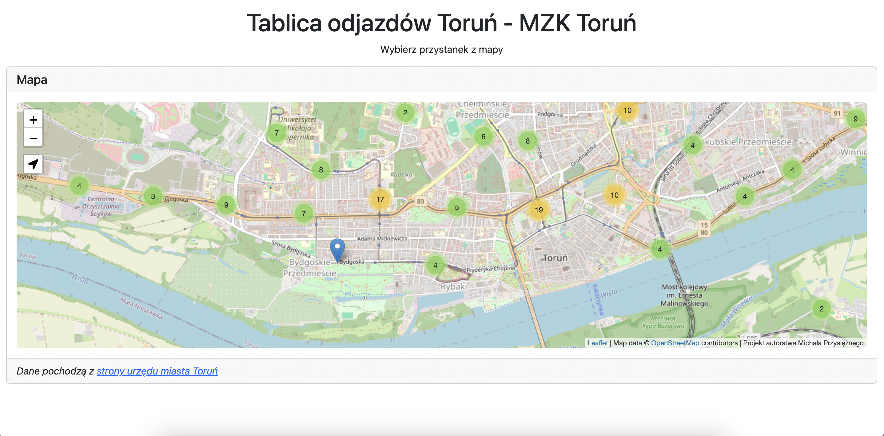
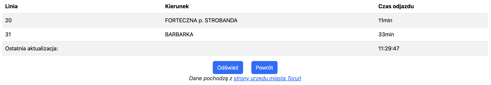

# Interactive Bus Schedule - MZK Toruń

A simple project created in Python and html to learn how to use the BeautifulSoup library and Leaflet in January this year

## Problem what project solves

Smart departure boards showing live bus arrival times are available at most bus stops in Toruń. Unfortunately, the City of Toruń does not provide bus or tram locations in GTFS Real Time format, and the ‘Toruń MZK’ live location viewing application for the iOS platform was not stable and is currently unavailable ([Link to App store](https://apps.apple.com/us/app/toru%C5%84-mzk/id1537006634?uo=4))

The city of Toruń provides a [website](http://sip.um.torun.pl:8080/), where it is possible to check how much time is left before departure, but unfortunately the site is not very intuitive and it is difficult to find a specific stop (there is no interactive map, among other things).

My project solves this problem - I use the GTFS file provided by the City of Toruń, superimpose the bus stops on the Open Street Map, and, after selecting a stop, execute a query to the python server which retrieves the data on departures directly from the City of Toruń website.

## Technologies used

- Python
- Flask
- BeautifulSoup
- Leaflet
- Open Street Map
- Bootstrap
- PWA

## How to run

1. Clone the repository
2. Install the required libraries from python files
3. Run api.py

## Screenshots

## Status

Project is _abandoned_

## Problem with the project

Often the [website] (http://sip.um.torun.pl:8080/) does not work and there may be a problem that the project will not display the departure board.

## Up to date

Status of stops up to date as of January 2024.
